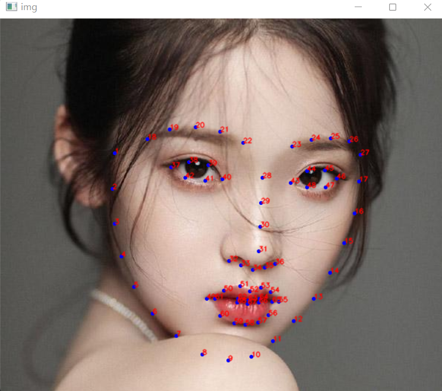
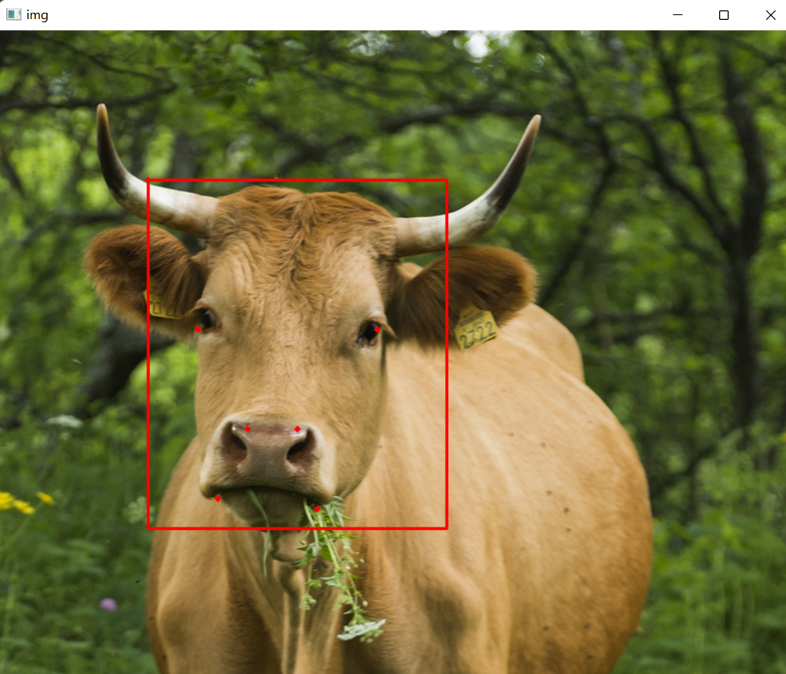

# Face Landmark Demo


## Overview

This repository is a small practice project for face landmark detection and facial region visualization using `dlib` and `OpenCV`.

## Preview

| Landmark Demo | Facial Region Demo |
| --- | --- |
|  |  |

## Highlights

- 68-point face-landmark detection
- visualization of facial regions such as eyes, eyebrows, nose, mouth, and jaw
- simple demo scripts that are easy to run and extend

## Project Structure

- `landmark_points.py`: detect a face and draw the 68 landmark points
- `visualize_face_parts.py`: highlight facial regions
- `figures/`: demo screenshots

## Setup

```bash
pip install -r requirements.txt
```

Download the dlib predictor file separately and place it in the project root:

```text
shape_predictor_68_face_landmarks.dat
```

## Usage

Draw landmark points:

```bash
python landmark_points.py --shape-predictor shape_predictor_68_face_landmarks.dat --image sample_images/3.jpg
```

Visualize facial regions:

```bash
python visualize_face_parts.py --shape-predictor shape_predictor_68_face_landmarks.dat --image sample_images/3.jpg
```

## Notes

- The repository does not include `shape_predictor_68_face_landmarks.dat`.
- This project focuses on demo visualization rather than training a new landmark model.
